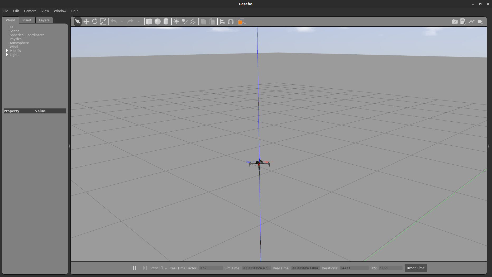

This simulation uses the **CrazyS** hovering example code to demonstrate how the simulation process using the **CrazyS** package works. To begin with let's create a cpp ros package:

```bash
cd /home/crazyuser/catkin_ws/src/
catkin_create_pkg hello_world
```

Now enter the package and create the script where the hovering example code will go:

```bash
cd hello_world
mkdir src launch
cd src
touch hovering_example.cpp
```

Following that, create the launch file that runs the simulation

```bash
cd ../launch
touch hovering_example.launch
```

After creating the package and setting up the file structure open the files in a text editor.

### hovering_example.cpp

Copy the contents of the **catkin_ws/src/CrazyS/rotors_gazebo/src/nodes/hovering_example.cpp** file to this file as no modifications are needed for this example.

### package.xml

Fill in the **package.xml** file as shown to include all the libraries needed. The contents of this file are based on the hovering example package provided by the **CrazyS** package.

```xml
<package>
  <name>rotors_gazebo</name>
  <version>7.0.1</version>
  <description>The rotors_gazebo package</description>

  <maintainer email="giuseppe.silano@fel.cvut.cz">Giuseppe Silano</maintainer>
  <maintainer email="luigi.iannelli@unisannio.it">Luigi Iannelli</maintainer>

  <author>Giuseppe Silano</author>
  <author>Emanuele Aucone</author>
  <author>Benjamin Rodriguez</author>
  <author>Luigi Iannelli</author>
  <author>Ria Sonecha</author>
  <author>Daniele Morra</author>

  <license>ASL 2.0</license>

  <url type="website">https://github.com/gsilano/CrazyS</url>
  <url type="bugtracker">https://github.com/gsilano/CrazyS/issues</url>

  <buildtool_depend>catkin</buildtool_depend>

  <!-- Dependencies needed to compile this package. -->
  <build_depend>gazebo_plugins</build_depend>
  <build_depend>rotors_gazebo_plugins</build_depend>
  <build_depend>mav_msgs</build_depend>
  <build_depend>nav_msgs</build_depend>
  <build_depend>gazebo_msgs</build_depend>
  <build_depend>geometry_msgs</build_depend>
  <build_depend>roscpp</build_depend>
  <build_depend>sensor_msgs</build_depend>
  <build_depend>cmake_modules</build_depend>
  <build_depend>tf</build_depend>
  <build_depend>tf2</build_depend>

  <!-- Dependencies needed after this package is compiled. -->
  <run_depend>gazebo_plugins</run_depend>
  <run_depend>dynamic_reconfigure</run_depend>
  <run_depend>rotors_gazebo_plugins</run_depend>
  <run_depend>mav_msgs</run_depend>
  <run_depend>nav_msgs</run_depend>
  <run_depend>gazebo_msgs</run_depend>
  <run_depend>geometry_msgs</run_depend>
  <run_depend>roscpp</run_depend>
  <run_depend>sensor_msgs</run_depend>
  <run_depend>tf</run_depend>
  <run_depend>tf2</run_depend>

</package>
```

### CMakeLists.txt

Finally, fill in the **CMakeLists.txt** file as shown to include all the libraries needed:

```cmake
cmake_minimum_required(VERSION 3.0.2)
project(hello_world)

add_definitions(-std=c++11)

find_package(catkin REQUIRED COMPONENTS
  mav_msgs
  roscpp
  cmake_modules
)

find_package(
  Eigen3 REQUIRED
)

catkin_package(
  INCLUDE_DIRS ${Eigen3_INCLUDE_DIRS}
  LIBRARIES spline_trajectory_generator
  CATKIN_DEPENDS geometry_msgs mav_msgs nav_msgs roscpp sensor_msgs gazebo_msgs
  DEPENDS Eigen3
)

include_directories(
  ${catkin_INCLUDE_DIRS}
  ${Eigen3_INCLUDE_DIRS}
)

add_executable(hovering_example src/hovering_example.cpp)
target_link_libraries(hovering_example ${catkin_LIBRARIES})
add_dependencies(hovering_example ${catkin_EXPORTED_TARGETS})


foreach(dir launch models resource worlds)
   install(DIRECTORY ${dir}/
      DESTINATION ${CATKIN_PACKAGE_SHARE_DESTINATION}/${dir})
endforeach(dir)

install(TARGETS hovering_example
  ARCHIVE DESTINATION ${CATKIN_PACKAGE_LIB_DESTINATION}
  LIBRARY DESTINATION ${CATKIN_PACKAGE_LIB_DESTINATION}
  RUNTIME DESTINATION ${CATKIN_PACKAGE_BIN_DESTINATION}
)

install(
  DIRECTORY include/${PROJECT_NAME}/
  DESTINATION ${CATKIN_PACKAGE_INCLUDE_DESTINATION}
  FILES_MATCHING PATTERN "*.h"
)
```

### Running the simulation

Before running the simulation the package must be build. To do this navigate to the **catkin_ws** folder and run the command ```catkin build```. After this the new built workspace must be sourced. To do this run the command ```source devel/setup.bash```. Now the simulation can be launched by running ```roslaunch hello_world hovering_example.launch```. You should see the gazebo gui launch and an instance of the crazyflie vehicle spawn. The simulation only performs a simple takeoff and hover.

<figure markdown>
  
  <figcaption>CrazyS hello_world demo</figcaption>
</figure>