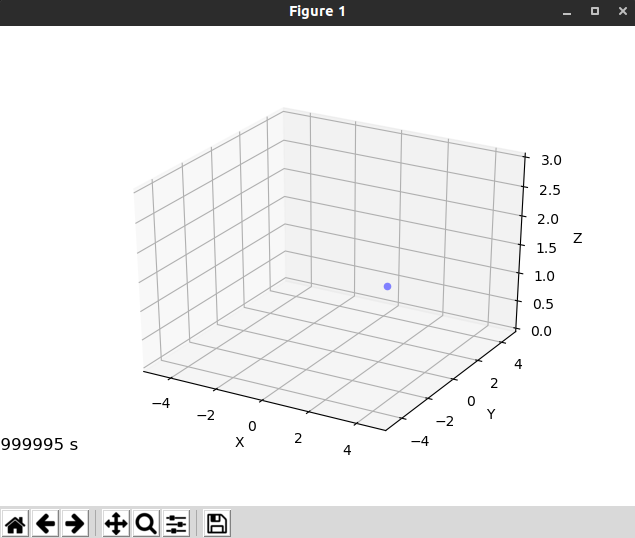

This simulation makes use of the **Crazyswarm** package to run a simulation where a single crazyflie takes-off, hovers and lands. First we need to create a package. Navigate to the crazyswarm workspace and run the following commands to create the files needed.

```bash
cd crazyswarm/ros_ws/src
mkdir -p hello_world/scripts
cd hello_world
mkdir launch
touch package.xml
touch CMakeLists.txt
cd scripts
touch hello_world.py
cd ../launch
touch crazyflies.yaml
```

Now open this folder and edit the files created according to the following instructions. 

#### package.xml

Copy this into the **package.xml** file to include the needed libraries.

```xml
<?xml version="1.0"?>
<package format="2">
  <name>hello_world</name>
  <version>0.0.0</version>
  <description>The hello_world package</description>

  <!-- One maintainer tag required, multiple allowed, one person per tag -->
  <!-- Example:  -->
  <!-- <maintainer email="jane.doe@example.com">Jane Doe</maintainer> -->
  <maintainer email="crazyuser@todo.todo">crazyuser</maintainer>

  <!-- One license tag required, multiple allowed, one license per tag -->
  <!-- Commonly used license strings: -->
  <!--   BSD, MIT, Boost Software License, GPLv2, GPLv3, LGPLv2.1, LGPLv3 -->
  <license>TODO</license>

  <build_depend>message_generation</build_depend>
  <exec_depend>message_runtime</exec_depend>
  <buildtool_depend>catkin</buildtool_depend>
  <build_depend>rospy</build_depend>
  <build_depend>std_msgs</build_depend>
  <build_depend>geometry_msgs</build_depend>
  <build_depend>rosgraph_msgs</build_depend>
  <build_depend>vizualization_msgs</build_depend>
  <build_depend>crazyswarm</build_depend>
  <build_export_depend>rospy</build_export_depend>
  <build_export_depend>std_msgs</build_export_depend>
  <exec_depend>rospy</exec_depend>
  <exec_depend>std_msgs</exec_depend>
  <exec_depend>geometry_msgs</exec_depend>
  <exec_depend>rosgraph_msgs</exec_depend>
  <exec_depend>vizualization_msgs</exec_depend>
  <exec_depend>crazyswarm</exec_depend>

</package>
```

#### CMakeLists.txt

Copy this into the CMakeLists.txt file to include the needed libraries.

```cmake
cmake_minimum_required(VERSION 3.0.2)
project(hello_world)

find_package(catkin REQUIRED COMPONENTS
  rospy
  std_msgs
  geometry_msgs
  rosgraph_msgs
  crazyswarm
)

catkin_package(
)

include_directories(
  ${catkin_INCLUDE_DIRS}
)

```

#### hello_world.py

This file contains the actual script that sends the take-off, hover and land commands to the crazyfly. Copy the following into the file.

```python
"""Takeoff-hover-land for one CF. Useful to validate hardware config."""
import sys
from os.path import dirname, abspath
sys.path.insert(0, dirname(dirname(dirname(abspath(__file__))))+"/crazyswarm/scripts")
print(dirname(dirname(dirname(abspath(__file__))))+"/crazyswarm/scripts")
from pycrazyswarm import Crazyswarm


TAKEOFF_DURATION = 2.5
HOVER_DURATION = 5.0


def main():
    crazyflies_yaml = dirname(dirname(abspath(__file__)))+"/launch/crazyflies.yaml"
    swarm = Crazyswarm(crazyflies_yaml=crazyflies_yaml)
    timeHelper = swarm.timeHelper
    cf = swarm.allcfs.crazyflies[0]

    cf.takeoff(targetHeight=1.0, duration=TAKEOFF_DURATION)
    timeHelper.sleep(TAKEOFF_DURATION + HOVER_DURATION)
    cf.land(targetHeight=0.04, duration=2.5)
    timeHelper.sleep(TAKEOFF_DURATION)


if __name__ == "__main__":
    main()

```

#### crazyflies.yaml

This file contains your vehicle definitions. To learn how to use this file check the **Crazyswarm** [documentation](https://crazyswarm.readthedocs.io/en/latest/configuration.html). For now a simulation example is given.

```yaml
crazyflies:
- channel: 100
  id: 1
  initialPosition: [1.5, 1.5, 0.0]
  type: medium

```

Now that all the files have been edited the package can be built. This only needs to be done once to create the package as python scripts do not need to be compiled. Navigate to the crazyswarm/ros_ws folder and run the command ```catkin_make``` to build the workspace. After this the newly built workspace must be sourced. To do this run the command ```source devel/setup.bash```.

#### Simulation

To run the simulation execute the following commands.

```bash
cd ~/crazyswarm/ros_ws/src/hello_world/scripts
chmod +x hello_world.py
python3 hello_world.py --sim
```
<figure markdown>
  
  <figcaption>Crazyswarm hello_world simulation demo</figcaption>
</figure>

#### Real Experiment

Before running the real experiment make sure you have properly configured the id and channel of your crazyflies in the **crazyflies.yaml** file. Copy the launch file used to launch the crazyswarm server.

```bash
cp ~/crazyswarm/ros_ws/src/crazyswarm/launch/hover_swarm.launch ~/crazyswarm/ros_ws/src/hello_world/launch/run.launch
```

Now recompile and resource the workspace.

```bash
cd ~/crazyswarm/ros_ws
catkin_make
source devel/setup.bash
```

Finally to run the experiment execute the following commands.

```bash
roslaunch hello_world run.launch
cd ~/crazyswarm/ros_ws/src/hello_world/scripts
python3 hello_world.py
```